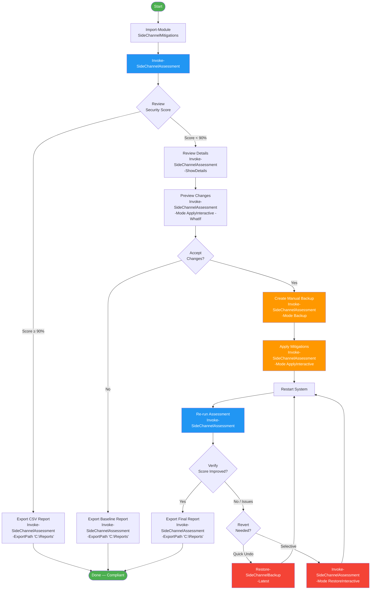

# SideChannelMitigations

[](https://www.powershellgallery.com/packages/SideChannelMitigations)
[](https://www.powershellgallery.com/packages/SideChannelMitigations)
[](https://github.com/PowerShell/PowerShell)
[](https://www.microsoft.com/windows)
[](LICENSE)
[](https://github.com/BetaHydri/SideChannelMitigations/graphs/commit-activity)

## 📖 Overview

**Enterprise-grade PowerShell tool** for assessing and managing Windows side-channel vulnerability mitigations with comprehensive hardware detection, intelligent platform-aware scoring, and automated backup/restore capabilities.

### What it does

🛡️ **Comprehensive Security Assessment**
- Evaluates **20 side-channel mitigations** (Spectre, Meltdown, L1TF, MDS, Retbleed, MMIO, and more)
- Assesses **5 hardware security prerequisites** (UEFI, Secure Boot, TPM 2.0, VT-x, IOMMU)
- Provides **runtime kernel-level detection** via Windows API for authoritative status
- Maps each mitigation to **specific CVE identifiers** with NVD/Microsoft references

🎯 **Platform-Aware Intelligence**
- **Automatic platform detection** (Physical, Hyper-V Host/Guest, VMware Guest)
- **Fair scoring system** - only counts applicable mitigations for your platform
- **Hyper-V hosts**: All 20 mitigations evaluated (including L1TF, Core Scheduler)
- **VMware/Hyper-V guests**: 17 mitigations (skips hypervisor-only features)
- **ESXi/vSphere guidance** - PowerCLI scripts and vSphere configuration instructions

🎨 **Intelligent Color Coding**
- **Green** = Protected/Active (mitigation working correctly)
- **Red** = Critical vulnerability (immediate action required)
- **Yellow** = Optional/High-impact (evaluate based on environment - L1TF, SMT disable)
- **Gray** = Informational (prerequisites, hardware status)

💾 **Advanced Backup & Recovery**
- **Automatic backups** before applying changes (ApplyInteractive mode)
- **Manual backups** for creating checkpoint snapshots
- **Quick revert** to latest backup (one command)
- **Selective restore** - browse all backups, restore specific mitigations
- **Timestamped JSON backups** with full metadata

📊 **Educational & Actionable**
- **Detailed mode** (`-ShowDetails`) shows CVE numbers, descriptions, URLs, impact levels
- **Performance impact ratings** (Low/Medium/High/Very High) for informed decisions
- **Specific recommendations** per mitigation with platform-specific guidance
- **Visual security score** with progress bar (█░) and percentage rating

### Who should use this

✅ **System Administrators** - Harden Windows servers and workstations against CPU vulnerabilities  
✅ **Security Teams** - Audit compliance and generate security assessment reports  
✅ **Hyper-V Administrators** - Configure host and guest mitigations correctly  
✅ **VMware Administrators** - Validate Windows VMs and follow ESXi hardening guidance  
✅ **IT Auditors** - Export CSV reports for compliance documentation  
✅ **Enterprise IT** - Deploy consistent security baselines across infrastructure

### Key Features

- ✅ **5 dedicated modes**: Assess, Apply, Revert, Backup, RestoreInteractive
- ✅ **PowerShell 5.1 & 7.x compatible** (Windows PowerShell & PowerShell Core)
- ✅ **WhatIf preview** for all modification operations
- ✅ **CSV export** for reporting and documentation
- ✅ **Microcode detection** - alerts when BIOS updates are needed
- ✅ **Comprehensive logging** - full audit trail of all operations
- ✅ **MIT licensed** - free for personal and commercial use

---

## 🎯 Features

For a detailed version history, see the [CHANGELOG](CHANGELOG.md).

## 🚀 Quick Start

### Prerequisites
- Windows 10/11 or Windows Server 2016+
- PowerShell 5.1 or PowerShell 7.x
- Administrator privileges
- Execution policy allowing script execution

```powershell
# Set execution policy (if needed)
Set-ExecutionPolicy -ExecutionPolicy RemoteSigned -Scope CurrentUser
```

> **⚠️ Virtual Machine Users:** If running on a VM, the **hypervisor host must also have mitigations enabled**
> and restarted before CPU-specific features (PSDP, Retbleed, MMIO) will work in the guest VM.
> See [`HYPERVISOR_CONFIGURATION.md`](HYPERVISOR_CONFIGURATION.md) for complete setup instructions.

### Installation

```powershell
# Install preview from PSGallery
Install-Module -Name SideChannelMitigations -AllowPrerelease -Scope CurrentUser

# Import after installation
Import-Module SideChannelMitigations
```

**Or build from source:**

```powershell
git clone https://github.com/BetaHydri/SideChannelMitigations.git
Set-Location SideChannelMitigations
.\build.ps1
Import-Module ./output/module/SideChannelMitigations
```

### Basic Usage

```powershell
# 1. Assessment (default mode) - Check current security status
Invoke-SideChannelAssessment

# 2. Detailed educational view - Learn about CVEs and impacts
Invoke-SideChannelAssessment -ShowDetails

# 3. Apply mitigations interactively - Harden your system (auto-backup created)
Invoke-SideChannelAssessment -Mode ApplyInteractive

# 4. Preview changes first - See what will change before applying
Invoke-SideChannelAssessment -Mode ApplyInteractive -WhatIf

# 5. Quick undo - Revert to most recent backup instantly
Invoke-SideChannelAssessment -Mode Revert

# 6. Advanced recovery - Browse backups, restore selectively
Invoke-SideChannelAssessment -Mode RestoreInteractive

# 7. Manual backup - Create checkpoint before risky changes
Invoke-SideChannelAssessment -Mode Backup
```

**When to use which mode:**
- **Assess** → Checking security status, generating reports
- **ShowDetails** → Learning about vulnerabilities and recommendations
- **ApplyInteractive** → Hardening system (backup auto-created)
- **Revert** → Undo recent changes quickly (latest backup only)
- **RestoreInteractive** → Browse all backups, selective restore,
  choose what to restore
- **Backup** → Creating manual checkpoint (optional,
  ApplyInteractive auto-creates one)

---

### Exported Functions

| Function | Purpose |
|----------|---------|
| `Invoke-SideChannelAssessment` | Main orchestrator — runs assessments, applies mitigations, manages backups/restores |
| `Export-SideChannelAssessment` | Exports assessment results to a CSV file in a specified folder |
| `Get-SideChannelMitigationDefinition` | Returns all mitigation definitions (registry paths, CVEs, metadata) |
| `New-SideChannelBackup` | Creates a timestamped JSON backup of current mitigation registry values |
| `Restore-SideChannelBackup` | Restores mitigation settings from a specific or latest backup file (non-interactive; for interactive browse/select use `-Mode RestoreInteractive`) |

### `Invoke-SideChannelAssessment`

The primary entry point. Supports five operation modes, WhatIf, and CSV export.

```powershell
# Default assessment
Invoke-SideChannelAssessment

# Detailed view with CVEs, descriptions, URLs
Invoke-SideChannelAssessment -ShowDetails

# Export results to a folder (CSV filename auto-generated)
Invoke-SideChannelAssessment -ExportPath 'C:\Reports'

# Preview mitigation changes without applying
Invoke-SideChannelAssessment -Mode ApplyInteractive -WhatIf

# Apply mitigations interactively (auto-creates backup)
Invoke-SideChannelAssessment -Mode ApplyInteractive

# Quick revert to latest backup
Invoke-SideChannelAssessment -Mode Revert

# Create a manual backup snapshot
Invoke-SideChannelAssessment -Mode Backup

# Browse all backups and selectively restore
Invoke-SideChannelAssessment -Mode RestoreInteractive
```

**Parameters:**

| Parameter | Type | Description |
|-----------|------|-------------|
| `-Mode` | `string` | `Assess` (default), `ApplyInteractive`, `Revert`, `Backup`, `RestoreInteractive` |
| `-ShowDetails` | `switch` | Display CVE numbers, descriptions, URLs, and impact levels |
| `-ExportPath` | `string` | Destination **folder** for CSV export. Filename is auto-generated as `SideChannelAssessment_<ComputerName>_<yyyyMMdd_HHmmss>.csv` |
| `-LogPath` | `string` | Destination **folder** for operation logs. Filename is auto-generated as `SideChannelCheck_<yyyyMMdd_HHmmss>.log` |
| `-BackupPath` | `string` | Custom backup directory (default: module `Backups/` directory) |
| `-ConfigPath` | `string` | Custom config directory (default: module `Config/` directory) |

### `Export-SideChannelAssessment`

Exports enriched assessment results to a semicolon-delimited CSV. Typically called indirectly by `Invoke-SideChannelAssessment -ExportPath`, but can be used standalone.

```powershell
# Get mitigation definitions and run your own assessment pipeline
$defs = Get-SideChannelMitigationDefinition

# Export results from a prior assessment
Export-SideChannelAssessment -Results $results -Path 'C:\Reports'
# → Creates C:\Reports\SideChannelAssessment_SERVER01_20260401_120000.csv
```

**CSV details:**
- **18 columns** with full untruncated data (Id, Name, Category, Status, CVE, URL, etc.)
- **Semicolon (`;`) delimiter** — avoids conflicts with comma-separated lists in data fields
- **PowerShell 5.1 and 7.x compatible** — version-specific export handling

### `Get-SideChannelMitigationDefinition`

Returns an array of hashtables containing all mitigation definitions. Useful for custom reporting, filtering, or integration with other tools.

```powershell
# List all mitigation definitions
Get-SideChannelMitigationDefinition

# Filter for critical mitigations only
Get-SideChannelMitigationDefinition | Where-Object { $_.Category -eq 'Critical' }

# Get a specific mitigation by Id
Get-SideChannelMitigationDefinition | Where-Object { $_.Id -eq 'KVAS' }

# Count mitigations by category
Get-SideChannelMitigationDefinition | Group-Object Category | Select-Object Name, Count
```

Each definition includes: `Id`, `Name`, `CVE`, `Category`, `RegistryPath`, `RegistryName`, `EnabledValue`, `Description`, `Impact`, `Platform`, `RuntimeDetection`, `Recommendation`, `URL`.

### `New-SideChannelBackup`

Creates a JSON backup of current mitigation registry values with WhatIf support.

```powershell
# Create a backup of all current mitigation settings
New-SideChannelBackup -Mitigations (Get-SideChannelMitigationDefinition)

# Preview backup operation
New-SideChannelBackup -Mitigations (Get-SideChannelMitigationDefinition) -WhatIf
```

Backup files are saved as `Backups/Backup_<yyyyMMdd_HHmmss>.json` with metadata (timestamp, computer name, user, all registry values).

### `Restore-SideChannelBackup`

Restores mitigation settings from a backup file. Supports WhatIf and two parameter sets: restore a specific file or the latest backup.

> **Note:** This function is **non-interactive** and designed for
> scripts, automation, and pipelines. For an interactive experience
> (browse backups, select by number, selectively restore individual
> mitigations), use
> `Invoke-SideChannelAssessment -Mode RestoreInteractive` instead.

```powershell
# Restore from the most recent backup
Restore-SideChannelBackup -Latest

# Restore from a specific backup file
Restore-SideChannelBackup -Path '.\Backups\Backup_20260401_120000.json'

# Preview latest restore without making changes
Restore-SideChannelBackup -Latest -WhatIf

# Use a custom backup directory
Restore-SideChannelBackup -Latest -BackupPath 'D:\Backups\SideChannel'
```

### Enterprise Pipeline Examples

```powershell
# Assess multiple servers and export reports
$servers = @('SERVER01', 'SERVER02', 'SERVER03')
$servers | ForEach-Object {
    Invoke-Command -ComputerName $_ -ScriptBlock {
        Import-Module SideChannelMitigations
        Invoke-SideChannelAssessment -ExportPath 'C:\SecurityReports'
    }
}

# Audit all servers and collect results centrally
$servers | ForEach-Object {
    $session = New-PSSession -ComputerName $_
    Invoke-Command -Session $session -ScriptBlock {
        Import-Module SideChannelMitigations
        Invoke-SideChannelAssessment -ExportPath 'C:\Temp'
    }
    # Copy the generated CSV back to a central share
    Copy-Item -FromSession $session -Path 'C:\Temp\SideChannelAssessment_*.csv' `
              -Destination "\\FileServer\SecurityAudits\$_\" -Force
    Remove-PSSession $session
}

# Compare mitigation definitions across module versions
$defs = Get-SideChannelMitigationDefinition
$defs | Select-Object Id, Name, Category, CVE | Format-Table -AutoSize
```

---

## 🔄 Best Practices Workflow

The following flowchart shows the recommended workflow for assessing and hardening systems using this module.



**Legend:**
- 🟢 **Green** — Start/End states
- 🔵 **Blue** — Assessment phases
- 🟠 **Orange** — Change operations (backup, apply)
- 🔴 **Red** — Recovery operations (revert, restore)

---

## �📋 Available Modes

### 1. **Assess** (Default)
Evaluate current security posture without making changes.

```powershell
# Standard assessment
Invoke-SideChannelAssessment

# With detailed educational output
Invoke-SideChannelAssessment -ShowDetails

# Export results to CSV
Invoke-SideChannelAssessment -ExportPath "C:\Reports"

# Combine assessment with CSV export
Invoke-SideChannelAssessment -ShowDetails -ExportPath "C:\Reports"
```

**Parameters:**
- **`-ExportPath`** - Destination folder for CSV export (filename auto-generated as `SideChannelAssessment_<ComputerName>_<timestamp>.csv`)
- **`-ShowDetails`** - Show detailed educational information (CVEs, descriptions, impacts)
- **`-LogPath`** - Optional: Destination folder for operation logs (filename auto-generated as `SideChannelCheck_<yyyyMMdd_HHmmss>.log`)

**Note:** The log file contains execution details (what the script did), while ExportPath creates a CSV of your security assessment data (what mitigations are enabled/disabled). Most users only need `-ExportPath` for reporting.

**Output:**
- Platform Information (CPU, OS, Hypervisor status)
- Hardware Security Features (Firmware, Secure Boot, TPM, VT-x, IOMMU, VBS/HVCI capability)
- Hardware Prerequisites Status (5 checks)
- Security Mitigations Status (19 mitigations)
- Enhanced Visual Security Score Bar with block characters (█░)
- Color-coded recommendations with emoji indicators
- Detailed mitigation table with impact assessment

**Hardware Security Features Display:**
The platform information section now includes comprehensive hardware capability detection:
- **Firmware** - UEFI (green) or Legacy BIOS (yellow)
- **Secure Boot** - Enabled (green), Capable but Disabled (yellow), or Not Supported (red)
- **TPM** - Present with version (green) or Not Detected (red)
- **VT-x/AMD-V/ARM VHE** - CPU virtualization status (green enabled, red disabled)
- **IOMMU/VT-d/ARM SMMU** - I/O memory management detection (green detected, red not detected)
- **VBS Capable** - Hardware prerequisites met for Virtualization Based Security (green yes, red no with hints)
- **HVCI Capable** - Hardware prerequisites met for Hypervisor-protected Code Integrity

Color coding helps quickly identify missing security prerequisites and provides contextual hints for missing requirements (e.g., "Requires: UEFI" when VBS is not capable).

**Color Coding & Category System:**

The tool uses intelligent color coding based on **mitigation category** and **severity**, not just status:

- 🟢 **Green (Protected)** - Mitigation is active and working correctly
- 🔴 **Red (Critical Vulnerability)** - Critical mitigation is missing or inactive (requires immediate action)
- 🟡 **Yellow (Optional/Consider)** - Optional or high-impact mitigation not enabled (evaluate based on your environment)
- ⚪ **Gray (Informational)** - Prerequisites, hardware status, or other informational items

**Mitigation Categories:**
- **Critical** - Must be enabled for baseline security (Red when vulnerable)
  * Examples: SSBD, BTI, KVAS, SBDR, PSDP
  * Action: Apply immediately
- **Recommended** - Should be enabled for comprehensive protection (Red when vulnerable)
  * Examples: MDS, TSX Disable, SRBDS, Retbleed, MMIO
  * Action: Apply unless specific reason not to
- **Optional** - Consider based on environment and threat model (Yellow when not enabled)
  * Examples: L1TF (high performance impact, Hyper-V multi-tenant only)
  * Examples: Hyper-V Core Scheduler (Hyper-V hosts only)
  * Examples: Disable SMT (extreme ~50% performance loss)
  * Action: Evaluate if benefits outweigh performance impact
- **Prerequisite** - Hardware/firmware features (informational)
  * Examples: UEFI, Secure Boot, TPM 2.0, VT-x, IOMMU
  * Action: Configure in BIOS/UEFI if missing

**Understanding Color Decisions:**
- **L1TF showing Yellow?** → Correct! It's Optional with High performance impact (~40% loss), only for multi-tenant Hyper-V
- **SBDR/PSDP showing Red?** → Correct! These are Critical vulnerabilities requiring immediate action
- **MDS showing Green?** → CPU has hardware immunity (modern Intel CPUs like Tiger Lake+)

### 📸 Sample Output


*Example output from a **production Hyper-V host** showing realistic security hardening: Green (protected mitigations), Yellow (optional/high-impact mitigations like L1TF, Core Scheduler, Disable SMT), and Red (vulnerabilities requiring attention). This configuration achieves **maximum security without extreme performance penalties** by applying Low/Medium impact mitigations while leaving High/Very High impact settings as optional (yellow).*

### 🖥️ Platform Applicability Matrix

The tool automatically detects your platform and only evaluates **applicable mitigations** for fair scoring.

#### Platform Support Matrix

| Mitigation | Physical | Hyper-V<br>Host | Hyper-V<br>Guest | VMware<br>Guest | ESXi/vSphere<br>Host | Notes |
|:-----------|:--------:|:---------------:|:----------------:|:---------------:|:--------------------:|:------|
| **SSBD** (Speculative Store Bypass) | ✅ | ✅ | ✅ | ✅ | ⚠️ | x86/x64 only; ARM64 uses firmware mitigation |
| **BTI** (Branch Target Injection) | ✅ | ✅ | ✅ | ✅ | ⚠️ | x86/x64 only; ARM64 uses firmware mitigation |
| **KVAS** (Kernel VA Shadowing) | ✅ | ✅ | ✅ | ✅ | ⚠️ | Windows only; ESXi via vSphere |
| **MDS** (Microarchitectural Data Sampling) | ✅ | ✅ | ✅ | ✅ | ⚠️ | Windows only; ESXi via vSphere |
| **TAA** (TSX Asynchronous Abort) | ✅ | ✅ | ✅ | ✅ | ⚠️ | Windows only; ESXi via vSphere |
| **SBDR** (SRBDS) | ✅ | ✅ | ✅ | ✅ | ⚠️ | Windows only; ESXi via vSphere |
| **Retbleed** | ✅ | ✅ | ✅ | ✅ | ⚠️ | Windows only; ESXi via vSphere |
| **MMIO Stale Data** | ✅ | ✅ | ✅ | ✅ | ⚠️ | Windows only; ESXi via vSphere |
| **PSDP** (Predictive Store Forwarding) | ✅ | ✅ | ✅ | ✅ | ⚠️ | Windows only; ESXi via vSphere |
| **BHI** (Branch History Injection) | ✅ | ✅ | ✅ | ✅ | ⚠️ | Windows only; ESXi via vSphere |
| **SBDS** (SRBDS) | ✅ | ✅ | ✅ | ✅ | ⚠️ | Windows only; ESXi via vSphere |
| **Enhanced IBRS** | ✅ | ✅ | ✅ | ✅ | ⚠️ | Windows only; ESXi via vSphere |
| **Control Flow Guard** | ✅ | ✅ | ✅ | ✅ | ❌ | Windows feature only |
| **SMAP** (Supervisor Mode Access Prevention) | ✅ | ✅ | ✅ | ✅ | ⚠️ | Windows only; ESXi via vSphere |
| **VBS** (Virtualization Based Security) | ✅ | ✅ | ✅ | ✅ | ❌ | Windows feature only |
| **HVCI** (Hypervisor Code Integrity) | ✅ | ✅ | ✅ | ✅ | ❌ | Windows feature only |
| **Credential Guard** | ✅ | ✅ | ✅ | ✅ | ❌ | Windows feature only |
| **L1TF** (L1 Terminal Fault) | ❌ | ✅ | ❌ | ❌ | ⚠️ | Hyper-V hosts only; ESXi via vSphere |
| **Hyper-V Core Scheduler** | ❌ | ✅ | ❌ | ❌ | ❌ | Hyper-V feature only |
| **Disable SMT** | ✅ | ✅ | ✅ | ✅ | ⚠️ | All platforms; ESXi via vSphere |

**Legend:**
- ✅ = Supported and assessed by this tool
- ❌ = Not applicable to this platform
- ⚠️ = Cannot run PowerShell script (configure via vSphere client)

> **💻 ARM64 Note:** On ARM64 systems (e.g., Qualcomm Snapdragon,
> Microsoft SQ, Ampere), the registry-based mitigations for SSBD
> (CVE-2018-3639), SSBD Feature Mask, and BTI (CVE-2017-5715) are
> **automatically skipped**. These vulnerabilities exist on ARM
> processors but are mitigated at the **firmware level**
> (`SMCCC_ARCH_WORKAROUND_1` for Spectre v2,
> `SMCCC_ARCH_WORKAROUND_2` for SSBD) rather than via Windows
> registry keys. See
> [Arm Spectre/Meltdown Security Bulletin](https://developer.arm.com/Arm%20Security%20Center/Speculative%20Processor%20Vulnerability)
> for details.

**Platform-Specific Behavior:**
- **Windows platforms** (Physical, Hyper-V, VMware Guest): Script runs directly and assesses applicable mitigations
- **VMware Guest**: L1TF and Hyper-V Core Scheduler are **skipped** (not counted in score)
- **Hyper-V Host**: All mitigations evaluated, L1TF shows as **yellow** (optional for multi-tenant only)
- **ESXi/vSphere Hosts**: Linux-based hypervisor - **cannot run PowerShell scripts**
  - Configure side-channel mitigations via vSphere Client or ESXCLI
  - L1TF mitigation: Configure via Advanced Settings (VMkernel.Boot.hyperthreadingMitigation)
  - See VMware KB articles for ESXi-specific hardening
- **Score is always fair**: Only counts mitigations that make sense for your platform!

**Example Scores:**
- VMware VM: 17/19 mitigations (L1TF & Core Scheduler skipped)
- Hyper-V Host: 19/19 mitigations (all applicable)
- Physical Desktop: 17/19 mitigations (hypervisor-only skipped)

---

### 🔧 ESXi/vSphere Administrator Guidance

**This tool is for Windows systems only.** If you manage VMware ESXi/vSphere hosts, use the following VMware-native approaches:

#### Checking ESXi Side-Channel Mitigations

**Option 1: vSphere Client (GUI)**
1. Select ESXi host → Configure → System → Advanced System Settings
2. Search for relevant parameters:
   - `VMkernel.Boot.hyperthreadingMitigation` - L1TF/MDS protection
   - `VMkernel.Boot.speculativeStoreBypassDisable` - SSBD (CVE-2018-3639)
   - `VMkernel.Boot.ibpbEnabled` - IBPB for Spectre v2

**Option 2: ESXCLI (Command Line)**
```bash
# Check current side-channel mitigation status
esxcli system settings kernel list -o hyperthreadingMitigation
esxcli system settings kernel list -o speculativeStoreBypassDisable
esxcli system settings kernel list -o ibpbEnabled

# Check CPU microcode version
esxcli hardware cpu global get | grep -i microcode

# List all security-related kernel settings
esxcli system settings kernel list | grep -i specul
```

**Option 3: PowerCLI (from Windows/Linux management station)**
```powershell
# Connect to vCenter/ESXi
Connect-VIServer -Server vcenter.domain.com

# Check all hosts for L1TF mitigation
Get-VMHost | Select Name, @{N="L1TF";E={($_ | Get-AdvancedSetting -Name "VMkernel.Boot.hyperthreadingMitigation").Value}}

# Check SSBD status
Get-VMHost | Select Name, @{N="SSBD";E={($_ | Get-AdvancedSetting -Name "VMkernel.Boot.speculativeStoreBypassDisable").Value}}

# Check microcode version
Get-VMHost | Select Name, @{N="Microcode";E={$_.ExtensionData.Hardware.CpuPkg[0].MicrocodeVersion}}
```

#### Key VMware KB Articles

- **KB79832** - Side-channel mitigations for ESXi 7.0 and later
- **KB55636** - Spectre and Meltdown mitigations for ESXi
- **KB52245** - L1 Terminal Fault (L1TF) mitigation
- **KB79832** - MDS (Microarchitectural Data Sampling) mitigation
- **VMware Security Advisories**: https://www.vmware.com/security/advisories

#### Recommended ESXi Hardening Steps

1. **Update ESXi and microcode** - Install latest patches from VMware
2. **Enable hypervisor-assisted mitigations** - Configure VMkernel parameters
3. **Disable SMT if necessary** - For highly sensitive multi-tenant environments
4. **Harden Windows VMs** - Use this tool on Windows VMs running on ESXi
5. **Regular audits** - Use PowerCLI scripts to audit entire vSphere environment

---

**Detailed Output** (`-ShowDetails` flag):
When using `-ShowDetails`, each mitigation displays comprehensive educational information:
- **CVE Numbers** - Associated vulnerability identifiers
- **Description** - What the mitigation protects against
- **Runtime Status** - Actual kernel-level protection state
- **Registry Status** - Configured values
- **Impact** - Performance implications (Low/Medium/High)
- **Recommendations** - Actions needed (if any)

Example detailed output:
```
• Speculative Store Bypass Disable [Protected]
  CVE:          CVE-2018-3639
  URL:          https://nvd.nist.gov/vuln/detail/CVE-2018-3639
  Description:  Prevents Speculative Store Bypass (Variant 4) attacks
  Runtime:      ✓ Active
  Registry:     Enabled
  Impact:       Low

• UEFI Firmware [Active]
  CVE:          Boot Security Prerequisite
  URL:          https://uefi.org/specifications
  Required For: Secure Boot, VBS, HVCI, Credential Guard
  Description:  UEFI firmware mode (required for Secure Boot and modern security)
  Runtime:      ✓ Active
  Impact:       None

• TPM 2.0 [Protected]
  CVE:          Hardware Cryptographic Security
  Required For: BitLocker, VBS, Credential Guard, Windows Hello
  Description:  Trusted Platform Module for hardware-based cryptography
  Runtime:      ✓ Active (2.0)
  Impact:       None
```

**Screenshots with `-ShowDetails` flag:**


*Detailed view showing comprehensive information for each mitigation including CVE numbers, descriptions, runtime status, registry status, and performance impact. This educational format helps administrators understand what each mitigation protects against.*


*Continuation of detailed output with runtime status guide explaining the meaning of different status indicators (Active, Inactive, Not Needed, Not Supported) for informed decision-making.*

---

### 2. **ApplyInteractive**
Interactively select and apply security mitigations with two selection modes.

```powershell
# Interactive application
Invoke-SideChannelAssessment -Mode ApplyInteractive

# Preview changes first (recommended)
Invoke-SideChannelAssessment -Mode ApplyInteractive -WhatIf
```

**Selection Modes:**
- **[R] Recommended** - Shows only actionable/recommended mitigations (default)
- **[A] All Mitigations** - Shows all 24+ available mitigations for selective hardening

**Recommended Workflow:**
1. Run detailed assessment: `Invoke-SideChannelAssessment -ShowDetails`
2. Review CVEs, descriptions, impacts, and recommendations
3. **Create manual backup:** `Invoke-SideChannelAssessment -Mode Backup` (recommended before any changes)
4. Use ApplyInteractive with mode [A] to selectively enable mitigations
5. Make informed decisions based on your security requirements
6. Restart system to activate changes
7. **If needed, restore from backup:** `.\Invoke-SideChannelAssessment -Mode Revert` (latest) or `-Mode RestoreInteractive` (browse backups)

**Features:**
- ✅ Automatic backup creation before changes (ApplyInteractive mode)
- ✅ Manual backup recommended for safety before starting remediation
- ✅ Interactive selection (individual, ranges, or all)
- ✅ Two view modes: Recommended only or All mitigations
- ✅ WhatIf preview support
- ✅ Impact warnings and current status display
- ✅ System restart notification

**Selection Syntax:**
- `1,3,5` - Apply specific mitigations (comma-separated)
- `1-4` - Apply range of mitigations
- `2-4,6-8,10` - Apply multiple ranges and individual items
- `all` - Apply all shown mitigations
- `critical` - Apply only critical mitigations
- `Q` - Quit without changes

**Examples:**
```
Your selection: 1,3,5        # Selects items 1, 3, and 5
Your selection: 2-4          # Selects items 2, 3, and 4
Your selection: 1-3,5,7-9    # Selects items 1, 2, 3, 5, 7, 8, and 9
Your selection: all          # Selects all items
Your selection: critical     # Selects only critical items
```

### 3. **Revert**
**Quick undo:** Instantly revert to your most recent backup.

```powershell
# Revert to last backup
Invoke-SideChannelAssessment -Mode Revert

# Preview revert operation
Invoke-SideChannelAssessment -Mode Revert -WhatIf
```

**When to use:**
- ✅ You just applied changes and want to undo them quickly
- ✅ System is unstable after applying mitigations
- ✅ Simple one-step rollback to last known good state

**Features:**
- ✅ Automatically finds your most recent backup
- ✅ Complete restore only (all settings from that backup)
- ✅ Shows backup metadata (timestamp, computer, user)
- ✅ Confirmation prompt before reverting
- ✅ WhatIf preview of changes
- ✅ Detailed restore summary

**What it does:** No browsing, no selection - just instant rollback to your latest backup.

### 4. **Backup**
**Manual snapshot:** Create a backup before making changes or for safekeeping.

```powershell
# Create backup
Invoke-SideChannelAssessment -Mode Backup

# Preview backup operation
Invoke-SideChannelAssessment -Mode Backup -WhatIf
```

**When to use:**
- ✅ Before testing changes in production
- ✅ Creating a checkpoint before major configuration updates
- ✅ Scheduled backups for compliance/audit purposes
- ✅ Want to create multiple backup points to compare later

**Backup Contents:**
- Timestamp (ISO 8601 format)
- Computer name
- User name
- All mitigation registry values (24 settings)

**Backup Location:** `.\Backups\Backup_YYYYMMDD_HHMMSS.json`

**Note:** ApplyInteractive mode **automatically creates a backup** before applying changes, so manual backup is optional in that workflow.

### 5. **RestoreInteractive**
**Advanced recovery:** Browse all backups and choose what to restore (selective or complete).

```powershell
# Interactive restore
Invoke-SideChannelAssessment -Mode RestoreInteractive
```

**When to use:**
- ✅ Need to restore from an older backup (not just the latest)
- ✅ Want to restore only specific mitigations, not everything
- ✅ Comparing multiple backups before deciding which to restore
- ✅ Recovering from older configuration states
- ✅ Granular recovery (cherry-pick individual settings)

**Restore Options:**
- **[A] All mitigations** - Restore complete backup (all settings)
- **[S] Select individual** - Choose specific mitigations to restore (granular recovery)
- **[Q] Cancel** - Exit without changes

**Selection Syntax (when selecting individual mitigations):**
- `1,3,5` - Restore specific mitigations (comma-separated)
- `1-4` - Restore range of mitigations
- `2-4,6-8,10` - Restore multiple ranges and individual items
- `all` - Restore all mitigations from selected backup
- `Q` - Cancel restore operation

**Examples:**
```
Enter numbers: 1,3,5        # Restores items 1, 3, and 5
Enter numbers: 2-4          # Restores items 2, 3, and 4
Enter numbers: 1-3,5,7-9    # Restores items 1, 2, 3, 5, 7, 8, and 9
Enter numbers: all          # Restores all items
```

**Difference from Revert:**
- **Revert** = Quick undo to latest backup (one command, no choices)
- **RestoreInteractive** = Browse all backups, choose which one, choose what to restore (flexible)

**Features:**
- ✅ Lists all available backups with age and metadata
- ✅ Shows backup details (computer, user, timestamp, mitigation count)
- ✅ Interactive backup selection (choose from any backup, not just latest)
- ✅ Selective restoration with flexible range notation
- ✅ Full or partial restore support
- ✅ WhatIf preview available
- ✅ Intelligent filtering - skips hardware-only items (TPM, CPU features)
- ✅ Clean restore summary with success/skipped counts

**Restore Summary Example:**
```
Successfully restored: 21
Skipped (hardware-only): 3
```

**Use Cases:**
- Restore entire configuration after testing
- Selectively restore specific mitigations
- Recover from misconfiguration
- Rollback individual settings while keeping others

**Note:** Hardware-only features (TPM 2.0, CPU Virtualization, IOMMU) are firmware/BIOS settings and cannot be restored from registry backups. These are automatically skipped during restore operations.

---

## 🔍 Comprehensive Assessment Output

### Sample Output

```
================================================================================
  SideChannelMitigations - Version 3.0.0
================================================================================

[Debug] Detecting platform type...
[Info] Platform detected: HyperVHost
[Debug] Detecting hardware security features...
[Success] Hardware detection complete
[Debug] Initializing kernel runtime state detection...
[Success] Kernel runtime state detection: Operational

--- Platform Information ---
Type:        HyperVHost
CPU:         11th Gen Intel(R) Core(TM) i7-11370H @ 3.30GHz
OS:          Microsoft Windows 11 Enterprise (Build 26200)

--- Hardware Security Features ---
Firmware:    UEFI
Secure Boot: Enabled
TPM:         Present (2.0)
VT-x/AMD-V:  Enabled
IOMMU/VT-d:  Detected
VBS Capable: Yes
HVCI Capable:Yes
[Info] Starting mitigation assessment...
[Success] Assessment complete: 30 mitigations evaluated

--- Security Assessment Summary ---
Total Mitigations Evaluated:  23
Protected:                    23 (100%)

Security Score: [████████████████████████████████████████] 100%
Security Level: Excellent

--- Hardware Prerequisites ---
Prerequisites Enabled: 5 / 5

--- Mitigation Status ---

Note: Use -ShowDetails flag to see the enhanced 7-column detailed table with CVE, Platform, Impact, and Required For columns.

Simple Table (default view):
Mitigation                                    Status               Action Needed             Impact
--------------------------------------------  -------------------  ------------------------  ---------
Speculative Store Bypass Disable             Protected           No                       Low
SSBD Feature Mask                            Protected           No                       Low
Branch Target Injection Mitigation           Protected           No                       Low
Kernel VA Shadow (Meltdown Protection)       Protected           No                       Medium
Enhanced IBRS                                Protected           No                       Low
Intel TSX Disable                            Protected           No                       Low
L1 Terminal Fault Mitigation                 Protected           No                       High
MDS Mitigation (ZombieLoad)                  Protected           No                       Medium
TSX Asynchronous Abort Mitigation            Protected           No                       Medium
Hardware Security Mitigations                Protected           No                       Low
SBDR/SBDS Mitigation                         Protected           No                       Low
SRBDS Update Mitigation                      Protected           No                       Low
DRPW Mitigation                              Protected           No                       Low
Exception Chain Validation                   Protected           No                       Low
Supervisor Mode Access Prevention            Protected           No                       Low
Virtualization Based Security                Protected           No                       Low
Hypervisor-protected Code Integrity          Protected           No                       Low
Credential Guard                             Protected           No                       Low
Hyper-V Core Scheduler                       Protected           No                       Medium
UEFI Firmware                                Active              No                       None
Secure Boot                                  Protected           No                       None
TPM 2.0                                      Protected           No                       None
CPU Virtualization (VT-x/AMD-V/ARM VHE)   Protected           No                       None
IOMMU (VT-d/AMD-Vi/ARM SMMU)               Protected           No                       None

Detailed Table (with -ShowDetails flag):
Mitigation                     Category     Status       CVE                       Platform     Impact   Required For
-----------------------------  -----------  -----------  ------------------------  -----------  -------  -----------------------------------
Speculative Store Bypass Di... Critical     Protected    CVE-2018-3639             All          Low      -
SSBD Feature Mask              Critical     Protected    CVE-2018-3639             All          Low      -
Branch Target Injection Mit... Critical     Protected    CVE-2017-5715 (Spectre... All          Low      -
Kernel VA Shadow (Meltdown ... Critical     Protected    CVE-2017-5754 (Meltdow... All          Medium   -
Virtualization Based Security  Optional     Protected    Kernel Isolation          All          Low      HVCI, Credential Guard
UEFI Firmware                  Prerequisite Active       Boot Security Prerequi... All          None     Secure Boot, VBS, HVCI, Credent...
Secure Boot                    Prerequisite Protected    Boot Malware Protection   All          None     VBS, HVCI, Credential Guard
TPM 2.0                        Prerequisite Protected    Hardware Cryptographic... All          None     BitLocker, VBS, Credential Guar...
CPU Virtualization (VT-x/AM... Prerequisite Protected    Virtualization Prerequ... All          None     Hyper-V, VBS, HVCI, Credential ...
IOMMU (VT-d/AMD-Vi/ARM SM...   Prerequisite Protected    DMA Protection            All          None     HVCI, VBS (full isolation), Ker...

✓ All critical mitigations are properly configured!
```

**Note:** The security score bar uses filled blocks (█) for protected mitigations and light blocks (░) for unprotected ones, providing a clear visual representation. The bar is color-coded: Green (≥90%), Cyan (≥75%), Yellow (≥50%), Red (<50%).

### Detailed Status Explanation

**Mitigation Status Values:**
- **Protected** - Mitigation is properly configured and active
- **Vulnerable** - Mitigation is not configured or disabled
- **Not Applicable** - Hardware doesn't support this mitigation
- **Unknown** - Status cannot be determined

**Prerequisite Status Values:**
- **Protected** - Feature is enabled and active (Secure Boot, TPM, VT-x, IOMMU)
- **Active** - Feature is present and working (UEFI)
- **Vulnerable** - Feature is supported but not enabled (e.g., Secure Boot capable but disabled)
- **Missing** - Feature is not available on this hardware

### Sample Output - ApplyInteractive Mode

```
================================================================================
  SideChannelMitigations - Version 3.0.0
================================================================================

Invoke-SideChannelAssessment -Mode ApplyInteractive

=== Interactive Mitigation Application ===
Select mitigations to apply (or 'all' for recommended, 'critical' for critical only)

[1] L1 Terminal Fault Mitigation
    High performance impact; primarily for multi-tenant virtualization environments
    Impact: High | CVE: CVE-2018-3620

[2] MDS Mitigation (ZombieLoad)
    Protects against MDS attacks
    Impact: Medium | CVE: CVE-2018-12130

Enter selections (e.g., '1,2,5' or '1-3' or 'all' or 'critical'): 2

You have selected 1 mitigation(s):
  • MDS Mitigation (ZombieLoad)

A backup will be created before applying changes.
Do you want to proceed? (Y/N): Y

[INFO] Creating configuration backup...
[SUCCESS] Backup created: C:\...\Backups\Backup_20251126_153045.json

Applying mitigations...
[INFO] Applying: MDS Mitigation (ZombieLoad)
[SUCCESS] Applied: MDS Mitigation (ZombieLoad)

=== Summary ===
Successfully applied: 1
Backup saved: C:\...\Backups\Backup_20251126_153045.json

⚠ A system restart is required for changes to take effect.
```

### Sample Output - WhatIf Mode

```
================================================================================
  SideChannelMitigations - Version 3.0.0
================================================================================

Invoke-SideChannelAssessment -Mode ApplyInteractive -WhatIf

=== Interactive Mitigation Application ===
[WhatIf Mode] Changes will be previewed but not applied

Select mitigations to apply (or 'all' for recommended, 'critical' for critical only)

[1] MDS Mitigation (ZombieLoad)
    Protects against MDS attacks
    Impact: Medium | CVE: CVE-2018-12130

Enter selections (e.g., '1,2,5' or '1-3' or 'all' or 'critical'): 1

You have selected 1 mitigation(s):
  • MDS Mitigation (ZombieLoad)

=== WhatIf: Changes Preview ===
The following changes would be made:

[MDS] MDS Mitigation (ZombieLoad)
  Registry Path: HKLM:\SYSTEM\CurrentControlSet\Control\Session Manager\kernel
  Registry Name: MDSMitigationLevel
  New Value: 1
  Impact: Medium

WhatIf Summary:
Total changes that would be made: 1
Backup would be created: Yes
System restart would be required: Yes
```

### Sample Output - Backup Mode

```
Invoke-SideChannelAssessment -Mode Backup

================================================================================
  SideChannelMitigations - Version 3.0.0
================================================================================

[Debug] Detecting platform type...
[Info] Platform detected: HyperVHost
[Debug] Detecting hardware security features...
[Success] Hardware detection complete
[Debug] Initializing kernel runtime state detection...
[Success] Kernel runtime state detection: Operational

--- Platform Information ---
Type:        HyperVHost
CPU:         11th Gen Intel(R) Core(TM) i7-11370H @ 3.30GHz
OS:          Microsoft Windows 11 Enterprise (Build 26200)

=== Create Configuration Backup ===

Creating backup of current mitigation settings...

✓ Backup created successfully!
Location: C:\...\Backups\Backup_20251126_201040.json

Backup Details:
Timestamp:   2025-11-26T20:10:40
Computer:    JANTIEDE-STUDIO
User:        jantiede
Mitigations: 21
```

**Backup with WhatIf Preview:**
```
Invoke-SideChannelAssessment -Mode Backup -WhatIf

=== Create Configuration Backup ===

[WhatIf Mode] Would create backup of current mitigation settings...

Backup would include:
Computer:    JANTIEDE-STUDIO
User:        jantiede
Mitigations: 21

Would save to: C:\...\Backups\Backup_<timestamp>.json
```

### Sample Output - RestoreInteractive Mode

```
Invoke-SideChannelAssessment -Mode RestoreInteractive

================================================================================
  SideChannelMitigations - Version 3.0.0
================================================================================

--- Platform Information ---
Type:        HyperVHost
CPU:         11th Gen Intel(R) Core(TM) i7-11370H @ 3.30GHz
OS:          Microsoft Windows 11 Enterprise (Build 26200)

=== Available Backups ===

[1] Backup_20251126_153622.json
    Computer: WORKSTATION01
    User: Administrator
    Created: 2025-11-26 15:36:22 (5m ago)
    Mitigations: 19

[2] Backup_20251126_143022.json
    Computer: WORKSTATION01
    User: Administrator
    Created: 2025-11-26 14:30:22 (1h ago)
    Mitigations: 19

Enter backup number to restore (or 'q' to quit): 1

=== Restore Preview ===
This will restore configuration from: 2025-11-26 15:36:22

Changes that will be made:
  [+] Restore: SSBD - Value: 72
  [+] Restore: SSBD Mask - Value: 3
  [+] Restore: BTI - Value: 0
  ... (16 more changes)

Total changes: 19
System restart required: Yes

Do you want to proceed? (Y/N): Y

[INFO] Restoring configuration from 2025-11-26T15:36:22...
[INFO] Restored: Speculative Store Bypass Disable
[INFO] Restored: SSBD Feature Mask
... (17 more)

=== Restore Summary ===
Successfully restored: 21
Skipped (hardware-only): 3

✓ Configuration restored.
⚠ A system restart is required for changes to take effect.
```

**Note:** Hardware-only features like TPM 2.0, CPU Virtualization, and IOMMU are automatically skipped as they are firmware/BIOS settings, not registry values.

### Sample Output - Revert Mode

```
Invoke-SideChannelAssessment -Mode Revert

================================================================================
  SideChannelMitigations - Version 3.0.0
================================================================================

--- Platform Information ---
Type:        HyperVHost
CPU:         11th Gen Intel(R) Core(TM) i7-11370H @ 3.30GHz
OS:          Microsoft Windows 11 Enterprise (Build 26200)

=== Revert to Most Recent Backup ===

Found most recent backup:
Timestamp: 2025-11-26T20:25:50
Computer:  JANTIEDE-STUDIO
User:      jantiede

Do you want to restore this backup? (Y/N): Y

[Info] Restoring configuration from 2025-11-26T20:25:50
[Info] Restored: Speculative Store Bypass Disable
[Info] Restored: SSBD Feature Mask
[Info] Restored: Branch Target Injection Mitigation
... (18 more)

=== Restore Summary ===
Successfully restored: 21
Skipped (hardware-only): 3

✓ Configuration restored.
⚠ A system restart is required.
```

### Sample Output - CSV Export

```
Invoke-SideChannelAssessment -ExportPath "C:\Reports"

================================================================================
  SideChannelMitigations - Version 3.0.0
================================================================================

[Assessment runs normally...]

✓ Assessment exported successfully to: C:\Reports\SideChannelAssessment_SERVER01_20260401_120000.csv
```

**CSV Features:**
- **18 columns** with complete, untruncated data
- **Semicolon (;) delimiter** to avoid conflicts with comma-separated dependency lists
- **Full PrerequisiteFor lists** (e.g., "Secure Boot, VBS, HVCI, Credential Guard")
- **All URL references** for external documentation
- **Platform information** (All/Physical/HyperVHost/etc.)
- **Compatible with both PowerShell 5.1 and 7+**

**CSV Content Preview:**
```csv
Id;Name;Category;Status;RegistryStatus;RuntimeStatus;ActionNeeded;CVE;Platform;Impact;PrerequisiteFor;CurrentValue;ExpectedValue;Description;Recommendation;RegistryPath;RegistryName;URL
SSBD;Speculative Store Bypass Disable;Critical;Protected;Enabled;Active;No;CVE-2018-3639;All;Low;-;8396872;8396872;Prevents Speculative Store Bypass (Variant 4) attacks;Intel CPUs: Set to 0x802048 (8396872) for Basic+BHI mitigations. AMD CPUs: Set to 0x2048 (8264) for Basic mitigations;HKLM:\SYSTEM\CurrentControlSet\Control\Session Manager\Memory Management;FeatureSettingsOverride;https://support.microsoft.com/en-us/topic/kb4072698
VBS;Virtualization Based Security;Optional;Protected;Enabled;N/A;No;Kernel Isolation;All;Low;HVCI, Credential Guard;1;1;Hardware-based security isolation using virtualization;Enable for enhanced kernel isolation (requires hardware support);HKLM:\SYSTEM\CurrentControlSet\Control\DeviceGuard;EnableVirtualizationBasedSecurity;https://learn.microsoft.com/en-us/windows-hardware/design/device-experiences/oem-vbs
UEFI;UEFI Firmware;Prerequisite;Active;N/A;Active;No;Boot Security Prerequisite;All;None;Secure Boot, VBS, HVCI, Credential Guard;True;;UEFI firmware mode (required for Secure Boot and modern security);UEFI mode required for Secure Boot, VBS, and HVCI;HKLM:\SYSTEM\CurrentControlSet\Control\SecureBoot\State;UEFISecureBootEnabled;https://uefi.org/specifications
...
```

**Note:** The CSV uses semicolons (;) as delimiters instead of commas to preserve comma-separated lists in the PrerequisiteFor column and other fields. This ensures data integrity when importing into Excel or other CSV tools.

---

## 🛡️ Mitigation Coverage

### Understanding BTI Protection Hierarchy

The tool detects BTI (Branch Target Injection / Spectre v2) protection in this order of preference:
1. **Enhanced IBRS** - Hardware-based protection (best performance, preferred when available)
2. **Retpoline** - Software-based protection (fallback for CPUs without Enhanced IBRS)
3. **BTI Basic** - Minimal protection

When the runtime status shows:
- `"Active (Enhanced IBRS)"` - Modern CPUs with hardware mitigation (Intel 8th gen+, AMD Zen 2+)
- `"Active (Retpoline)"` - Older CPUs using software-based mitigation
- `"Active"` - Basic BTI mitigation only

**Intel Guidance:** Enhanced IBRS should be used instead of Retpoline on supported processors. It provides the same protection with lower performance impact.

### Critical Mitigations (6)
- **SSBD** (Speculative Store Bypass Disable) - CVE-2018-3639
- **SSBD Mask** (Required companion setting)
- **BTI** (Branch Target Injection) - CVE-2017-5715 (Spectre v2)
- **KVAS** (Kernel VA Shadow) - CVE-2017-5754 (Meltdown)
- **Enhanced IBRS** - Hardware-based Spectre v2 protection (replaces Retpoline on supported CPUs)
- **Hardware Security Mitigations** - Core CPU protections

**Important:** Enhanced IBRS **only protects against Spectre v2/BTI** (indirect branch speculation). It does NOT protect against:
- Spectre v4 (SSBD) - requires separate SSBD mitigation
- Meltdown (KVAS) - requires page table isolation  
- MDS, SBDR, PSDP, L1TF, TAA, MMIO - each requires its own specific mitigation

When Enhanced IBRS shows "Active," only the BTI/Spectre v2 vulnerability is protected. All other vulnerabilities still need their respective mitigations enabled.

### Recommended Mitigations (11)
- **TSX Disable** - Prevents TAA vulnerabilities
- **MDS** (Microarchitectural Data Sampling) - CVE-2018-12130
- **TAA** (TSX Asynchronous Abort) - CVE-2019-11135
- **SBDR/SBDS** - CVE-2022-21123, CVE-2022-21125
- **SRBDS** - CVE-2022-21127
- **DRPW** - CVE-2022-21166
- **PSDP** (Predictive Store Forwarding Disable) - CVE-2022-0001, CVE-2022-0002
- **Retbleed** - CVE-2022-29900, CVE-2022-29901
- **MMIO Stale Data** - Processor MMIO vulnerabilities
- **Exception Chain Validation** - SEH protection
- **SMAP** (Supervisor Mode Access Prevention)

### Optional Mitigations (6)
- **L1TF** (L1 Terminal Fault) - CVE-2018-3620, CVE-2018-3646
  * High performance impact (15-25% loss)
  * Only for Hyper-V hosts running multi-tenant/untrusted VMs
  * NOT recommended for single-tenant environments, development hosts, or physical workstations
- **VBS** (Virtualization Based Security) - Requires hardware
- **HVCI** (Hypervisor-protected Code Integrity) - Requires VBS
- **Credential Guard** - Requires VBS + TPM
- **Hyper-V Core Scheduler** - For Hyper-V hosts
- **Disable SMT/Hyperthreading** - Maximum security (very high performance cost)

### Hardware Prerequisites (5)
- **UEFI Firmware** - Required for modern security
- **Secure Boot** - Boot integrity protection
- **TPM 2.0** - Hardware cryptographic security
- **CPU Virtualization (VT-x/AMD-V/ARM VHE)** - For Hyper-V and VBS
- **IOMMU (VT-d/AMD-Vi/ARM SMMU)** - DMA protection and HVCI optimization

---

## 🧪 Testing & Validation

### Manual Test Scenarios

#### Test 1: Basic Assessment
```powershell
Invoke-SideChannelAssessment

# Expected: 
# ✅ No errors or exceptions
# ✅ Security score displayed (0-100%)
# ✅ All mitigations evaluated
# ✅ Prerequisites shown separately
```

#### Test 2: WhatIf Preview
```powershell
Invoke-SideChannelAssessment -Mode ApplyInteractive -WhatIf

# Expected:
# ✅ No registry changes made
# ✅ Preview of all selected changes displayed
# ✅ "WhatIf Mode" clearly indicated
```

#### Test 3: Interactive Apply
```powershell
Invoke-SideChannelAssessment -Mode ApplyInteractive
# Select: 1,2

# Expected:
# ✅ Backup created before changes
# ✅ Only selected mitigations applied
# ✅ Success/failure count displayed
# ✅ System restart warning shown
```

#### Test 4: Backup & Restore
```powershell
# Create backup
Invoke-SideChannelAssessment -Mode Backup

# Browse backups
Invoke-SideChannelAssessment -Mode RestoreInteractive

# Expected:
# ✅ Backup file created in .\Backups\
# ✅ All backups listed with timestamps
# ✅ Age calculation correct (e.g., "2h ago")
```

#### Test 5: WhatIf with Revert
```powershell
Invoke-SideChannelAssessment -Mode Revert -WhatIf

# Expected:
# ✅ Lists latest backup
# ✅ Shows all changes that would be made
# ✅ No actual restore performed
```

---

## 📊 Performance Considerations

### Low Impact (<5% performance loss)
- SSBD, BTI, Enhanced IBRS, TSX Disable
- SBDR/SBDS, SRBDS, DRPW
- Exception Chain Validation, SMAP

### Medium Impact (5-15% performance loss)
- KVAS (Kernel VA Shadow / Meltdown)
- MDS (Microarchitectural Data Sampling)
- TAA (TSX Asynchronous Abort)
- Hyper-V Core Scheduler

### High Impact (15%+ performance loss)
- **L1TF (L1 Terminal Fault)** - CVE-2018-3620, CVE-2018-3646
  * **Performance Impact:** High (15-25% performance loss in virtualization workloads)
  * **What it does:** Flushes L1 data cache on every VM entry/exit to prevent L1 Terminal Fault attacks
  * **When to ENABLE:**
    - Multi-tenant cloud environments (untrusted VMs on same host)
    - Public cloud providers (AWS, Azure, GCP)
    - Hosting providers with customer VMs
    - High-security environments processing sensitive data in VMs
  * **When to DISABLE (or leave disabled):**
    - Single-tenant environments (only your VMs on the host)
    - Development/test Hyper-V hosts
    - Personal virtualization workstations
    - Trusted VM workloads only
    - Physical machines (non-Hyper-V hosts) - not applicable
    - Virtual machines (guests) - not applicable, host-only mitigation
  * **Platform:** Hyper-V Host only (not applicable to physical workstations or VM guests)
  * **Category:** Optional (only required for multi-tenant virtualization)
  * **Recommendation:** Only enable if you run untrusted VMs from different security domains on the same host
- **⚠️ Test in non-production first!**

---

## 🔒 Security Best Practices

### Recommended Workflow

1. **Assessment** → `Invoke-SideChannelAssessment`
2. **Planning** → `Invoke-SideChannelAssessment -Mode ApplyInteractive -WhatIf`
3. **Backup** → `Invoke-SideChannelAssessment -Mode Backup`
4. **Apply** → `Invoke-SideChannelAssessment -Mode ApplyInteractive`
5. **Validate** → Restart system, re-run assessment
6. **Restore** → `Invoke-SideChannelAssessment -Mode Revert` (latest)
   or `-Mode RestoreInteractive` (browse backups)

### Enterprise Deployment

```powershell
# Assess multiple systems
$computers = @("SERVER01", "SERVER02")
$computers | ForEach-Object {
    Invoke-Command -ComputerName $_ -ScriptBlock {
        Import-Module SideChannelMitigations
        Invoke-SideChannelAssessment -ExportPath "C:\Reports"
    }
}
```

---

## 🐛 Troubleshooting

### Access Denied
```powershell
# Solution: Run as Administrator
Start-Process powershell -Verb RunAs
```

### Backups not found
```powershell
# Check backup directory
Test-Path ".\Backups\"
Get-ChildItem ".\Backups\Backup_*.json"
```

### Export fails
```powershell
# Ensure export directory exists
New-Item -ItemType Directory -Path $ExportPath -Force
```

### WhatIf not working
```powershell
# Verify PowerShell supports ShouldProcess
Get-Help about_Functions_CmdletBindingAttribute
```

### Unicode characters not displaying correctly
**Solution:** The module uses runtime Unicode generation for full compatibility.

The script automatically generates Unicode characters (✓, ✗, ⚠, █, ░) at runtime using `[System.Char]::ConvertFromUtf32()`, ensuring consistent display across PowerShell 5.1 and 7.x without requiring specific file encoding.

**No action needed** - this is handled automatically by the `Get-StatusIcon` function.

### MitigationOptions showing as "Not Configured" after reboot
**Symptom:** The "Hardware Security Mitigations" mitigation shows as "Not Configured" or "Disabled" after system restart, even though it was properly applied.

**Cause:** Windows converts the `MitigationOptions` registry value from `REG_QWORD` to `REG_BINARY` after reboot. Older versions of the script couldn't read REG_BINARY format.

**Solution:** The module automatically handles REG_BINARY conversion. It:
- Detects when `MitigationOptions` is stored as a byte array (REG_BINARY)
- Converts the 8-byte array to `uint64` using `[BitConverter]::ToUInt64()`
- Performs correct bitwise comparison to verify the mitigation flag is set

**No action needed** - the current module version handles this correctly both before and after system restart.

**Technical Details:**
```powershell
# Before reboot: REG_QWORD (direct uint64 comparison)
# After reboot: REG_BINARY (converted from byte[] to uint64)
```

---

## ⚠️ Important Warnings

- ⚠️ **Always use -WhatIf first**
- ⚠️ **System restart required** after changes
- ⚠️ **Create backups** before modifications
- ⚠️ **Test in non-production** first

---

## 📝 Changelog

See the full [CHANGELOG](CHANGELOG.md) for detailed version history.

---

## 📦 Legacy Standalone Script

The original standalone script (`SideChannel_Check_v2.ps1`) and its
companion files have been moved to the [`legacy/`](legacy/) folder.
They are superseded by the v3.0.0 module but remain available for
reference.

| File | Description |
|---|---|
| `legacy/SideChannel_Check_v2.ps1` | Monolithic v2.3.0 standalone script |
| `legacy/Test-SideChannelTool.ps1` | Hand-rolled test harness for the v2 script |
| `legacy/Check-HyperVHostMitigations.ps1` | Hyper-V host diagnostic companion |

> **Note:** New deployments should use the module
> (`Install-Module SideChannelMitigations -AllowPrerelease`).

---

## 📄 License

MIT License

---

## 👤 Author

**Jan Tiedemann**
- GitHub: [@BetaHydri](https://github.com/BetaHydri)

---

## 📖 External Resources & Technical Documentation

### Official Vendor Documentation

#### Microsoft Security Guidance
- **[KB4073119: Windows Client Guidance for IT Pros](https://support.microsoft.com/en-us/topic/kb4073119-protect-against-speculative-execution-side-channel-vulnerabilities-in-windows-client-systems-6dd25de0-4d8e-4f7c-8a89-ddc88e3e8853)** - Primary reference for this tool
- **[Windows Kernel CVE Mitigations](https://msrc.microsoft.com/update-guide/vulnerability)** - Microsoft Security Response Center
- **[Virtualization-Based Security (VBS)](https://learn.microsoft.com/en-us/windows-hardware/design/device-experiences/oem-vbs)** - Hardware requirements and implementation
- **[Hypervisor-Protected Code Integrity (HVCI)](https://learn.microsoft.com/en-us/windows-hardware/drivers/bringup/device-guard-and-credential-guard)** - Memory integrity protection
- **[Credential Guard Deployment](https://learn.microsoft.com/en-us/windows/security/identity-protection/credential-guard/credential-guard)** - Enterprise credential protection
- **[Windows Defender Application Control](https://learn.microsoft.com/en-us/windows/security/threat-protection/windows-defender-application-control/windows-defender-application-control)** - Code integrity policies

#### Intel Security Advisories
- **[Spectre & Meltdown (CVE-2017-5753/5715/5754)](https://www.intel.com/content/www/us/en/developer/topic-technology/software-security-guidance/overview.html)** - Original side-channel vulnerabilities
- **[Retpoline: Branch Target Injection Mitigation](https://www.intel.com/content/www/us/en/developer/articles/technical/software-security-guidance/technical-documentation/retpoline-branch-target-injection-mitigation.html)** - Software mitigation technique for Spectre v2
- **[Enhanced IBRS](https://www.intel.com/content/www/us/en/developer/articles/technical/software-security-guidance/technical-documentation/indirect-branch-restricted-speculation.html)** - Hardware-based Spectre v2 mitigation (supersedes Retpoline when available)
- **[L1 Terminal Fault (L1TF) - CVE-2018-3620/3646](https://www.intel.com/content/www/us/en/developer/articles/technical/software-security-guidance/technical-documentation/l1-terminal-fault.html)** - L1 cache attacks
- **[Microarchitectural Data Sampling (MDS)](https://www.intel.com/content/www/us/en/developer/articles/technical/software-security-guidance/technical-documentation/microarchitectural-data-sampling.html)** - Multiple CVEs (2018-11091 through 12130)
- **[TAA - CVE-2019-11135](https://www.intel.com/content/www/us/en/developer/articles/technical/software-security-guidance/technical-documentation/intel-tsx-asynchronous-abort.html)** - TSX Asynchronous Abort
- **[Intel VT-x and VT-d](https://www.intel.com/content/www/us/en/virtualization/virtualization-technology/intel-virtualization-technology.html)** - Virtualization and IOMMU technology

#### AMD Security Documentation
- **[AMD Product Security](https://www.amd.com/en/resources/product-security.html)** - Security bulletins and advisories
- **[AMD-V (SVM) Technology](https://www.amd.com/en/technologies/virtualization-solutions)** - AMD Virtualization
- **[AMD Secure Encrypted Virtualization (SEV)](https://www.amd.com/en/developer/sev.html)** - VM memory encryption
- **[Spectre/Meltdown AMD Guidance](https://www.amd.com/en/resources/product-security/bulletin/amd-sb-1000.html)** - AMD-specific mitigations
- **[IOMMU (AMD-Vi) Specification](https://www.amd.com/content/dam/amd/en/documents/processor-tech-docs/programmer-references/48882_IOMMU.pdf)** - AMD I/O Memory Management Unit

#### Arm Security Documentation
- **[Arm Spectre/Meltdown Security Bulletin](https://developer.arm.com/Arm%20Security%20Center/Speculative%20Processor%20Vulnerability)** - Affected ARM processors and firmware mitigations
- **[Cache Speculation Side-channels White Paper](https://developer.arm.com/documentation/102816/)** - ARM cache timing side-channel analysis
- **[Spectre-BHB White Paper](https://developer.arm.com/documentation/102898/0107/)** - Branch History Injection on ARM
- **[SMC Calling Convention (SMCCC)](https://developer.arm.com/documentation/den0028/latest)** - Firmware workaround interface (WORKAROUND_1, WORKAROUND_2, WORKAROUND_3)

### CVE Databases & Tracking

#### NIST National Vulnerability Database
- **[CVE-2017-5753 (Spectre Variant 1)](https://nvd.nist.gov/vuln/detail/CVE-2017-5753)** - Bounds check bypass
- **[CVE-2017-5715 (Spectre Variant 2)](https://nvd.nist.gov/vuln/detail/CVE-2017-5715)** - Branch target injection
- **[CVE-2017-5754 (Meltdown)](https://nvd.nist.gov/vuln/detail/CVE-2017-5754)** - Rogue data cache load
- **[CVE-2018-3620 (L1TF)](https://nvd.nist.gov/vuln/detail/CVE-2018-3620)** - L1 Terminal Fault - OS/SMM
- **[CVE-2018-3646 (L1TF-VMM)](https://nvd.nist.gov/vuln/detail/CVE-2018-3646)** - L1 Terminal Fault - VMM
- **[CVE-2018-11091 (MDSUM)](https://nvd.nist.gov/vuln/detail/CVE-2018-11091)** - Microarchitectural Data Sampling Uncacheable Memory
- **[CVE-2018-12126 (MFBDS)](https://nvd.nist.gov/vuln/detail/CVE-2018-12126)** - Microarchitectural Fill Buffer Data Sampling
- **[CVE-2018-12127 (MLPDS)](https://nvd.nist.gov/vuln/detail/CVE-2018-12127)** - Microarchitectural Load Port Data Sampling
- **[CVE-2018-12130 (MSBDS)](https://nvd.nist.gov/vuln/detail/CVE-2018-12130)** - Microarchitectural Store Buffer Data Sampling
- **[CVE-2019-11135 (TAA)](https://nvd.nist.gov/vuln/detail/CVE-2019-11135)** - TSX Asynchronous Abort
- **[CVE-2022-0001 (BHI)](https://nvd.nist.gov/vuln/detail/CVE-2022-0001)** - Branch History Injection
- **[CVE-2022-0002 (BHI)](https://nvd.nist.gov/vuln/detail/CVE-2022-0002)** - Intra-Mode Branch Target Injection
- **[CVE-2022-21123 (SBDR)](https://nvd.nist.gov/vuln/detail/CVE-2022-21123)** - Shared Buffers Data Read
- **[CVE-2022-21125 (SBDS)](https://nvd.nist.gov/vuln/detail/CVE-2022-21125)** - Shared Buffers Data Sampling
- **[CVE-2022-21127 (SRBDS)](https://nvd.nist.gov/vuln/detail/CVE-2022-21127)** - Special Register Buffer Data Sampling
- **[CVE-2022-21166 (DRPW)](https://nvd.nist.gov/vuln/detail/CVE-2022-21166)** - Device Register Partial Write
- **[CVE-2022-29900 (Retbleed)](https://nvd.nist.gov/vuln/detail/CVE-2022-29900)** - Return Instruction Speculation (AMD)
- **[CVE-2022-29901 (Retbleed)](https://nvd.nist.gov/vuln/detail/CVE-2022-29901)** - Return Instruction Speculation (Intel)

### Research Papers & Technical Analysis

#### Academic Research
- **[Spectre Attacks: Exploiting Speculative Execution](https://spectreattack.com/spectre.pdf)** - Original Spectre paper (Kocher et al.)
- **[Meltdown: Reading Kernel Memory from User Space](https://meltdownattack.com/meltdown.pdf)** - Original Meltdown paper (Lipp et al.)
- **[Foreshadow: L1 Terminal Fault](https://foreshadowattack.eu/)** - L1TF attack website and papers
- **[ZombieLoad: MDS Attacks](https://zombieloadattack.com/)** - MDS vulnerability research
- **[RIDL: Rogue In-Flight Data Load](https://mdsattacks.com/)** - Additional MDS research

#### Performance Impact Studies
- **[Microsoft: Mitigations Performance Impact](https://techcommunity.microsoft.com/t5/windows-kernel-internals-blog/understanding-the-performance-impact-of-spectre-and-meltdown/ba-p/295062)** - Real-world performance analysis
- **[Red Hat: Speculative Execution Exploit Performance Impact](https://access.redhat.com/articles/3311301)** - Enterprise impact assessment
- **[VMware: Side-Channel Aware Scheduler](https://kb.vmware.com/s/article/55806)** - Hypervisor-level mitigations

### Virtualization Platform Security

#### VMware ESXi/vSphere
- **[VMware Security Advisories](https://www.vmware.com/security/advisories.html)** - vSphere security bulletins
- **[VMSA-2018-0004: Spectre/Meltdown](https://www.vmware.com/security/advisories/VMSA-2018-0004.html)** - VMware response
- **[Side-Channel Aware Scheduler (SCAS)](https://kb.vmware.com/s/article/55806)** - ESXi scheduler hardening

##### VMware VM Configuration for Hardware Prerequisites
When running as a VMware guest, the tool provides GUI-based instructions to enable missing hardware prerequisites:

- **Secure Boot**: Power off VM → Edit Settings → VM Options → Boot Options → Enable Secure Boot (requires EFI firmware)
- **TPM 2.0 (vTPM)**: Power off VM → Edit Settings → Add New Device → Trusted Platform Module → Add
- **CPU Virtualization**: Power off VM → Edit Settings → CPU → Enable 'Expose hardware assisted virtualization to the guest OS'
- **IOMMU**: Power off VM → Edit Settings → VM Options → Advanced → Enable 'Enable IOMMU'

**Note**: These settings require the VM to be powered off and may require ESXi/vSphere host-level configuration.
- **[ESXi Patch Tracker](https://esxi-patches.v-front.de/)** - Community patch database

#### Microsoft Hyper-V
- **[Hyper-V Security Documentation](https://learn.microsoft.com/en-us/windows-server/virtualization/hyper-v/hyper-v-security)** - Official hardening guide
- **[Hyper-V Core Scheduler](https://learn.microsoft.com/en-us/windows-server/virtualization/hyper-v/manage/manage-hyper-v-scheduler-types)** - SMT security improvements
- **[Shielded VMs](https://learn.microsoft.com/en-us/windows-server/security/guarded-fabric-shielded-vm/guarded-fabric-and-shielded-vms)** - Hardware-based VM isolation
- **[Nested Virtualization Security](https://learn.microsoft.com/en-us/virtualization/hyper-v-on-windows/user-guide/nested-virtualization)** - Nested VM considerations

##### ⚠️ CRITICAL: Virtual Machine Configuration Requirements

**For CPU-specific mitigations (PSDP, Retbleed, MMIO, Enhanced IBRS) to work in VMs:**

1. **The Hyper-V/ESXi host MUST have these mitigations enabled and active first**
2. The hypervisor host must be **restarted** after applying mitigations
3. Only then can the hypervisor expose these CPU features to guest VMs
4. VM processor compatibility mode must be disabled (Hyper-V) or CPUID masking removed (VMware)

**Registry settings alone in the VM are insufficient** - the physical CPU features must be active on the host first.

**Complete Configuration Guide:** See [HYPERVISOR_CONFIGURATION.md](HYPERVISOR_CONFIGURATION.md) for detailed step-by-step instructions for:
- Hyper-V host configuration
- VMware ESXi/Workstation configuration
- VM processor settings
- Verification procedures

## Troubleshooting

### Why do SBDR/PSDP show as "Vulnerable" even though registry values are set?

**Symptom:** Your tool shows SBDR, FBSDP, or PSDP as "Vulnerable" despite registry values being set to `1`.

**Root Cause:** These mitigations require **hardware support** and **microcode updates**. Setting registry values alone is insufficient.

**Detection Logic:**
- The tool reads **flags2** from the Windows kernel API (NtQuerySystemInformation)
- Checks if hardware is protected via bits: SBDR (0x01), FBSDP (0x02), PSDP (0x04)
- Checks if mitigation is **actually active** via FBClear bit (0x08)
- **Registry values alone don't enable protection if hardware doesn't support the feature**

**This aligns with Microsoft's SpeculationControl module v1.0.19**, which also reports these as "False" when:
1. Hardware is vulnerable (flags2 bit = 0)
2. FBClear mitigation is not enabled (flags2 bit 0x08 = 0)

**Solution:**
```powershell
# Compare with Microsoft's official tool
Get-SpeculationControlSettings

# Check for missing microcode updates
Get-HotFix | Where-Object { $_.Description -match 'Update' } | Sort-Object InstalledOn -Descending | Select-Object -First 10

# Install latest Windows Updates and CPU microcode
Windows Update → Check for updates → Install all available updates
# Or use Windows Update Catalog for specific CPU microcode package
```

**Why this happens:**
- **Intel CPUs**: May need microcode updates from Windows Update or BIOS updates
- **Older CPUs**: Some CPUs don't support these newer mitigations (hardware limitation)
- **Virtual Machines**: Host must have mitigations enabled first (see HYPERVISOR_CONFIGURATION.md)
- **AMD CPUs**: Automatically marked as "Hardware Immune" for Intel-specific vulnerabilities
- **ARM64 CPUs**: Registry-based SSBD/BTI mitigations skipped (handled via firmware; see [Arm Security Bulletin](https://developer.arm.com/Arm%20Security%20Center/Speculative%20Processor%20Vulnerability))

**Verification:**
If Microsoft's `Get-SpeculationControlSettings` also shows "Windows OS support is enabled: **False**", then your hardware genuinely doesn't support these features or is missing required updates.

### Why does my security score differ from Microsoft's SpeculationControl module?

**This module:**
- Performs **hardware-based detection** using Windows kernel APIs
- Checks if mitigations are **actually active** in the kernel
- Aligns detection logic with Microsoft's SpeculationControl module
- Shows 30 mitigations including prerequisites (UEFI, Secure Boot, TPM)

**Microsoft SpeculationControl:**
- Focuses on CPU speculation vulnerabilities only (10-15 mitigations)
- Does not include VBS, HVCI, Credential Guard
- Uses same kernel API detection (NtQuerySystemInformation)

**Both tools should agree on CPU mitigations (BTI, KVAS, MDS, SBDR, FBSDP, PSDP)**. If they differ, please report an issue.

##### Hyper-V VM Configuration for Hardware Prerequisites
When running as a Hyper-V guest, the tool provides PowerShell commands to enable missing hardware prerequisites:

- **Secure Boot**: `Set-VMFirmware -VMName '<vmname>' -EnableSecureBoot On` (requires Generation 2 VM)
- **TPM 2.0**: `Enable-VMTPM -VMName '<vmname>'` (requires Generation 2 VM and Key Protector)
- **CPU Virtualization**: `Set-VMProcessor -VMName '<vmname>' -ExposeVirtualizationExtensions $true`
- **IOMMU**: Automatically available for Generation 2 VMs with nested virtualization enabled

### Tools & Validation

#### Microsoft Official Tools
- **[SpeculationControl PowerShell Module](https://www.powershellgallery.com/packages/SpeculationControl)** - Microsoft's assessment tool
- **[Device Guard Readiness Tool](https://www.microsoft.com/en-us/download/details.aspx?id=53337)** - VBS/HVCI validation
- **[Windows Update Catalog](https://www.catalog.update.microsoft.com/)** - Microcode and patch downloads

#### Third-Party Validation Tools
- **[CPU-Z](https://www.cpuid.com/softwares/cpu-z.html)** - CPU feature detection
- **[HWiNFO](https://www.hwinfo.com/)** - Detailed hardware information
- **[InSpectre](https://www.grc.com/inspectre.htm)** - Steve Gibson's Spectre/Meltdown checker (retired)

### Compliance & Standards

#### Industry Standards
- **[CIS Windows Benchmarks](https://www.cisecurity.org/benchmark/microsoft_windows_desktop)** - Security configuration baselines
- **[NIST Cybersecurity Framework](https://www.nist.gov/cyberframework)** - Risk management guidelines
- **[PCI DSS Requirements](https://www.pcisecuritystandards.org/)** - Payment card industry security

#### Government Guidance
- **[NSA Cybersecurity Advisories](https://www.nsa.gov/Press-Room/Cybersecurity-Advisories-Guidance/)** - U.S. government recommendations
- **[CISA Known Exploited Vulnerabilities](https://www.cisa.gov/known-exploited-vulnerabilities-catalog)** - Critical vulnerability tracking

### Additional Learning Resources

#### Video Tutorials & Conferences
- **[Black Hat: Spectre & Meltdown Presentations](https://www.blackhat.com/)** - Security conference talks
- **[Microsoft Ignite: Windows Security Sessions](https://ignite.microsoft.com/)** - Enterprise security guidance
- **[DEF CON: Side-Channel Attack Research](https://www.defcon.org/)** - Cutting-edge security research

#### Community Resources
- **[/r/sysadmin - Windows Security](https://www.reddit.com/r/sysadmin/)** - IT professional community
- **[TechNet Forums (Archive)](https://social.technet.microsoft.com/Forums/)** - Microsoft community support
- **[Spiceworks Community](https://community.spiceworks.com/)** - IT Q&A and troubleshooting

### How to Use These Resources

1. **Start with Microsoft KB4073119** - Primary reference for Windows mitigation implementation
2. **Check your CPU vendor** (Intel/AMD/ARM) - Read vendor-specific guidance for your hardware
3. **Review CVE details** - Understand the specific vulnerabilities affecting your systems
4. **Assess performance impact** - Use Microsoft/Red Hat studies to plan mitigation deployment
5. **Validate with tools** - Cross-reference this module with Microsoft's SpeculationControl module
6. **Stay updated** - Subscribe to vendor security advisories for new vulnerabilities

---

**Version:** 3.4.0  
**Last Updated:** 2026-04-02  
**PowerShell:** 5.1, 7.x  
**Platform:** Windows 10/11, Server 2016+ (x86/x64; ARM64 with reduced scope)
